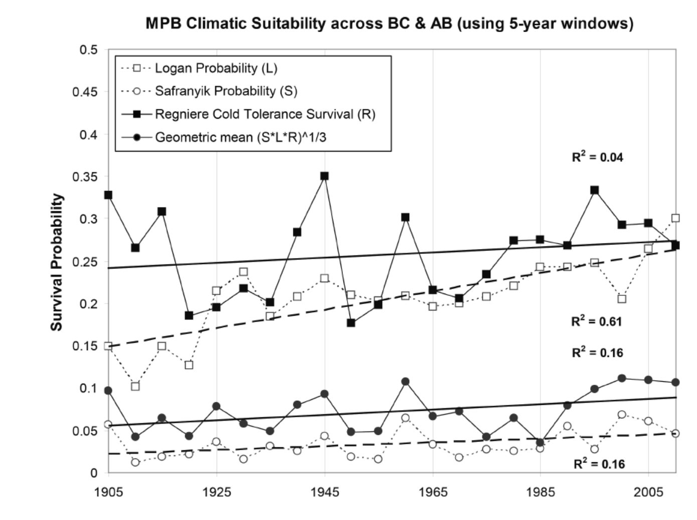

```{r setup, include=FALSE}
knitr::opts_chunk$set(echo = TRUE, eval = FALSE, results = "hold")
```

# Overview

Get MPB climatic suitability and wind layers.

## Climatic suitability indices

Over the last 20 years, and using four indices of MPB climatic suitability, there appears to be a long-term trend in enhanced MPB survival throughout BC and Alberta [@Cooke:2017fem], fuelled by accelerating warmth through the last 20 years.
The effects of temperature on seasonal biology in the US Rocky Mountains have been modelled by Logan et al. (1992).
The Logan suitability index (L) is based on summer temperatures [@Logan:2003fr].
The effects of temperature on winter mortality in the US Rocky Mountains have been modelled by @Regniere:2007ip.
In the Canadian context, the many effects of temperature on MPB recruitment in British Columbia have been modelled by @Safranyik:1975bk.
The Safranyik index (S) was subsequently extended to Alberta by @Carroll:2004rm.
Once the MPB had come into Alberta in large numbers in 2006 the Régnière index (R) was field validated in Alberta [@Cooke:2009ow].
The North America-wide outputs of these models under standard climate change scenarios were first presented in @Nealis:2008gc, and later received peer-review validation through @Bentz:2010bs and @Safranyik:2010ce.
A composite SLR index (G, the default) takes the geometric mean of these three models. These are described in further detail in @Nealis:2008gc and @Nealis:2014re.



Our simulation models explore 7 MPB climate scenarios (using each of the four indices: S, L, R, G) used as model drivers.
We use the `BioSIM` R package [@Fortin:2021] to get MPB SLR data from BioSim software [@Regniere:1995BioSim] to generate the climate suitability maps [see @Bentz:2010bs; @Logan:2003fr; @Safranyik:2010ce).
The values of each of these indices are bound between 0 and 1, and this value is used to scale the vertical shift of the red-top recruitment curve.
All climate maps are projected using a Lambert Conformal Conic projection and cover all of Canada.
Where possible, all data downloads and preprocessing were scripted for reproducibility from raw, original sources.

## Wind speed and direction

We use the `BioSIM` R package [@Fortin:2021] to get historical and projected wind data from BioSim software [@Regniere:1995BioSim], and use these to produce maps of wind speed direction for the month of July for each simulation year.

# Usage

```{r module_usage}
library(SpaDES.core)

setPaths(modulePath = file.path(".."))
getPaths() # shows where the 4 relevant paths are

times <- list(start = 0, end = 10)

parameters <- list(
  #.progress = list(type = "text", interval = 1), # for a progress bar
  ## If there are further modules, each can have its own set of parameters:
  #module1 = list(param1 = value1, param2 = value2),
  #module2 = list(param1 = value1, param2 = value2)
)
modules <- list("mpbClimateData")
objects <- list()
inputs <- list()
outputs <- list()

mySim <- simInit(times = times, params = parameters, modules = modules,
                 objects = objects)

mySimOut <- spades(mySim)
```

# Parameters

Provide a summary of user-visible parameters.

```{r moduleParams, echo = FALSE, eval = TRUE}
df_params <- SpaDES.core::moduleParams("mpbClimateData", "..")
knitr::kable(df_params)
```

# Events

Describe what happens for each event type.

## Plotting

Write what is plotted.

## Saving

Write what is saved.

# Data dependencies

## Input data

How to obtain input data, and a description of the data required by the module.
If `sourceURL` is specified, `downloadData("mpbClimateData", "..")` may be sufficient.

```{r moduleInputs, echo = FALSE, eval = TRUE}
df_inputs <- SpaDES.core::moduleInputs("mpbClimateData", "..")
knitr::kable(df_inputs)
```

## Output data

Description of the module outputs.

```{r moduleOutputs, echo = FALSE, eval = TRUE}
df_outputs <- SpaDES.core::moduleOutputs("mpbClimateData", "..")
knitr::kable(df_outputs)
```

# Links to other modules

Part of the `LandR_MPB` Mountain Pine Beetle Red Top Model, which evaluates short-run potential for MPB establishment, eruption, and spread.

- `mpbClimateData`
- `mpbMassAttacksData`
- `mpbPine`
- `mpbRedTopSpread`

Future linkages include the `LandR` Biomass suite of modules to simulate/forecast forest vegetation dynamics, and the `fireSense` wildfire simulation model.

# References
